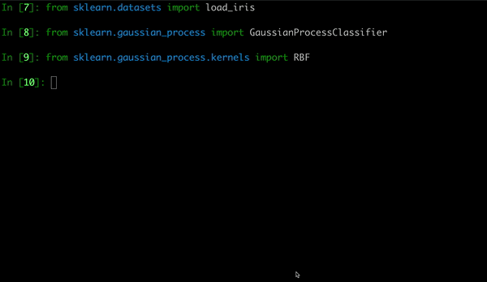

# Algomize

Algomize is a series of optimization algorithm in python (At the moment , only PSO is avaiable )
It is built on [Particle Swarm Optimization](https://github.com/nathanrooy/particle-swarm-optimization) project

It is intended to integrate with machine learning framework for researchers, practitioners, and
students

## Features

- auto detect the objective function from the framework
- (For Devs and Researchers): Highly-extensible API for implementing your own techniques.

## Installation

To install algomize, run this command in your terminal:

```shell
$ pip install algomize
```

## Usage

Algomize is user friendly and straight forward to use

### Using with Sklearn

Importing algomize particle swamp optimizer

```python
from algomize.pso import Pso
```

```python
from sklearn.datasets import load_iris
from sklearn.gaussian_process import GaussianProcessClassifier
from sklearn.gaussian_process.kernels import RBF
from algomize.pso import Pso # import algomize particle optimizer

X, y = load_iris(return_X_y=True)  #load dataset here
kernel = 1.0 * RBF(1.0)

pso = Pso()  #initialize the Particle swamp class
optimizer = pso.optimize(num_particles=15, maxiter=20, verbose=True) # pass in required paramters

gpc = GaussianProcessClassifier(kernel=kernel, optimizer=optimizer)
gpc.git(X, y)


```



The optimizer will run for a certain iterations and will return the best cost function and values to the model .

- Find bugs and fix them
- Implement new optimizers collection
- Make utility functions more robust.
